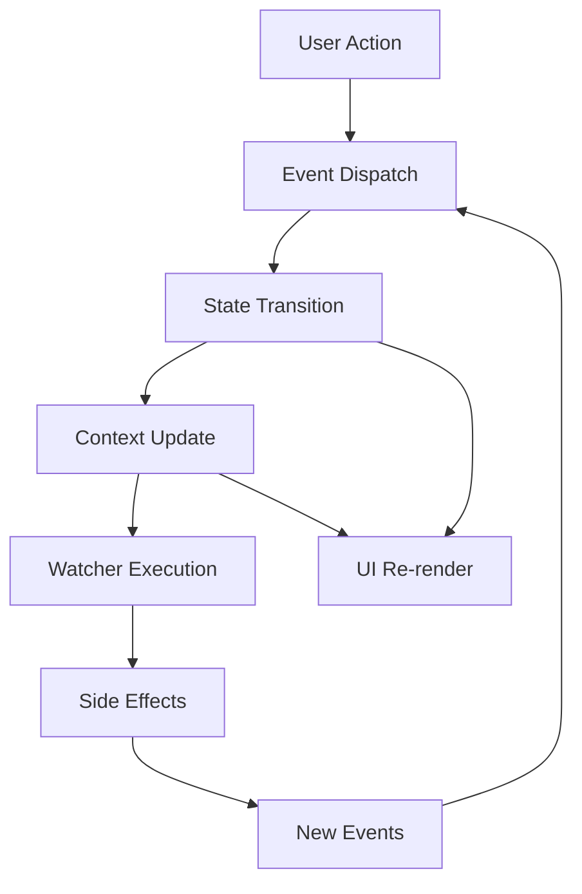

import { Tabs, Tab } from 'fumadocs-ui/components/tabs';
import { Callout } from 'fumadocs-ui/components/callout';

# Architecture & Design Philosophy

Elevo is built on carefully considered architectural principles that prioritize developer experience while maintaining the mathematical rigor that makes state machines powerful. This document explores the philosophy, design decisions, and architectural patterns that make Elevo unique.

## Core Design Philosophy

### 1. Developer Experience First

**Traditional state machines often fail adoption due to complexity**. Elevo prioritizes approachability without sacrificing power.

```tsx
// Complex but correct (traditional)
const machine = createMachine({
  id: 'document',
  initial: 'idle',
  context: { document: null, error: null },
  states: {
    idle: {
      on: { LOAD: 'loading' }
    },
    loading: {
      invoke: {
        id: 'loadDocument',
        src: 'documentService',
        onDone: { target: 'loaded', actions: 'setDocument' },
        onError: { target: 'error', actions: 'setError' }
      }
    }
  }
}, {
  services: { documentService: loadDocument },
  actions: { setDocument: assign({ document: (_, event) => event.data }) }
});

// Simple but powerful (Elevo)
const documentMachine = createMachine("document", (ctx) => {
  const { state, on } = ctx;
  return [
    state("idle", () => [on("LOAD", "loading")]),
    state("loading", () => [on("SUCCESS", "loaded"), on("ERROR", "error")]),
    state("loaded", () => [on("EDIT", "editing")]),
    state("error", () => [on("RETRY", "loading")])
  ];
});
```

**Key Principles:**
- **Intuitive APIs**: Functions feel natural to JavaScript developers
- **Gradual Learning**: Start simple, add complexity when needed
- **Excellent Tooling**: Real-time visualization and debugging
- **TypeScript First**: Superior type inference and safety

### 2. Functional Programming Alignment

Modern JavaScript increasingly embraces functional programming. Elevo aligns with this trend.

```tsx
// Functional composition
const loadingStates = (success: string, error: string) => [
  on("SUCCESS", success),
  on("ERROR", error),
  on("CANCEL", "idle")
];

const asyncPattern = (ctx: BuilderContext, name: string) => {
  const { state } = ctx;
  return [
    state("idle", () => [on("START", "loading")]),
    state("loading", () => loadingStates("success", "error")),
    state("success", () => [on("RESET", "idle")]),
    state("error", () => [on("RETRY", "loading")])
  ];
};

// Reuse patterns across machines
const userMachine = createMachine("user", (ctx) => asyncPattern(ctx, "user"));
const postMachine = createMachine("post", (ctx) => asyncPattern(ctx, "post"));
```

### 3. Separation of Concerns

Clear boundaries between different aspects of state management.

**Pure State Logic**: State machines handle only state transitions
**Side Effects**: Handled separately through watchers
**UI Concerns**: Managed in React components
**Data Flow**: Context flows through transitions

### 4. Progressive Disclosure

Start simple, add complexity gradually.

```tsx
// Level 1: Basic state machine
const toggle = createMachine("toggle", (ctx) => {
  const { state, on } = ctx;
  return [
    state("off", () => [on("TOGGLE", "on")]),
    state("on", () => [on("TOGGLE", "off")])
  ];
});

// Level 2: Add context
toggle.currentState.transition("TOGGLE", { timestamp: Date.now() });

// Level 3: Add global context
toggle.setGlobalOnly({ userId: "user-123" });

// Level 4: Add watchers
toggle.watchEntry("on", (context) => {
  analytics.track("toggle_activated", context);
});

// Level 5: Add complex business logic
const complexWorkflow = createMachine("workflow", (ctx) => {
  const { state, on, action } = ctx;
  return [
    state("draft", () => [
      on("SUBMIT", "review", action("validate")),
      on("SAVE_DRAFT", "draft", action("autosave"))
    ]),
    // ... more complex states
  ];
});
```

## Architectural Layers

Elevo's architecture consists of several distinct layers, each with specific responsibilities.

### Layer 1: Core State Machine Engine

The foundation provides pure state machine logic.

```tsx
// Core engine responsibilities:
// - State storage and transitions
// - Event validation
// - Context management
// - Watcher system

class StateMachineCore {
  private currentState: string;
  private privateContexts: Map<string, any>;
  private globalContext: Record<string, unknown>;
  private watchers: Map<string, Function[]>;
  
  transition(event: string): void {
    // Validate transition
    // Update state
    // Trigger watchers
    // Update context
  }
}
```

### Layer 2: Functional DSL

The builder layer provides the functional API.

```tsx
// DSL responsibilities:
// - Parse functional definitions
// - Build state maps
// - Validate state definitions
// - Provide builder context

interface BuilderContext {
  state: (name: string, builder: () => TransitionDefinition[]) => StateDefinition;
  on: (event: string, target: string, action?: ActionDefinition) => TransitionDefinition;
  action: (name: string, fn?: Function) => ActionDefinition;
}

function createMachine<TStates>(
  id: string,
  builder: (ctx: BuilderContext) => StateDefinition[]
): Machine<TStates> {
  // Parse builder function
  // Create state maps
  // Return machine instance
}
```

### Layer 3: React Integration

Reactive bindings for React applications.

```tsx
// React layer responsibilities:
// - Valtio proxy creation
// - React lifecycle integration
// - Selective re-rendering
// - Component utilities

function useMachine<TMachine extends Machine<any>>(
  machine: TMachine
): UseMachineReturn<TMachine> {
  const reactiveProxy = useMemo(() => proxy({
    get current() { return machine.current; },
    get context() { return machine.context; },
    get globalContext() { return machine.globalContext; }
  }), [machine]);
  
  return useSnapshot(reactiveProxy);
}
```

### Layer 4: Development Tools

CLI and visualization layer for development experience.

```tsx
// Development tools responsibilities:
// - File watching and parsing
// - Real-time updates
// - WebSocket communication
// - Visualization rendering

class ElevoCLI {
  private watcher: FileWatcher;
  private server: VisualizerServer;
  private parser: StateFileParser;
  
  async start(path: string) {
    // Watch *.state.ts files
    // Parse state machines
    // Update visualizer
    // Cache results
  }
}
```

## Data Flow Architecture

### Unidirectional Data Flow

Elevo enforces unidirectional data flow similar to Redux/Flux patterns.



### Context Flow

Context flows through the system in a predictable way.

```tsx
// Context flow example
machine.currentState.transition("EDIT", {
  // This context flows to the "editing" state
  fileName: "document.md",
  content: "Hello World",
  editStartTime: Date.now()
});

// Later transition carries context forward
machine.currentState.transition("SAVE", {
  // Previous context + new data
  ...machine.context,
  saveStartTime: Date.now(),
  hasChanges: true
});
```

### State Isolation

Each state maintains its own context scope.

```tsx
const machine = createMachine("document", (ctx) => {
  const { state, on } = ctx;
  return [
    // Each state has isolated context
    state("viewing", () => [on("EDIT", "editing")]),
    state("editing", () => [on("SAVE", "saving")]),
    state("saving", () => [on("SUCCESS", "viewing")])
  ];
});

// Context is isolated per state
machine.currentState.transition("EDIT", { viewStartTime: Date.now() });
console.log(machine.context); // { viewStartTime: ... }

machine.currentState.transition("SAVE", { content: "...", saveTime: Date.now() });
console.log(machine.context); // { content: "...", saveTime: ... }
// viewStartTime is no longer accessible
```

## Multi-Level State Management

### Hierarchical Organization

Elevo promotes organizing state machines in a hierarchical structure.

```
Application (Global State)
├── Authentication Machine
├── Theme Machine
├── Router Machine
└── Notification Machine

Pages (Route-Specific State)
├── Dashboard
│   ├── Analytics Machine
│   └── Data Fetching Machine
├── Editor
│   ├── Document Machine
│   ├── Collaboration Machine
│   └── Auto-save Machine
└── Settings
    ├── Preferences Machine
    └── Account Machine

Components (Local State)
├── Modal Machine
├── Form Validation Machine
├── Drag & Drop Machine
└── Search Machine
```

### Communication Patterns

Different levels communicate through well-defined patterns.

<Tabs>
<Tab value="events">
**Event-Based Communication**
```tsx
// Application-level auth machine
const authMachine = createMachine("auth", (ctx) => {
  const { state, on } = ctx;
  return [
    state("authenticated", () => [on("LOGOUT", "unauthenticated")]),
    state("unauthenticated", () => [on("LOGIN", "authenticated")])
  ];
});

// Page-level document machine reacts to auth changes
authMachine.watchEntry("unauthenticated", () => {
  // Redirect to login page
  documentMachine.currentState.transition("RESET");
});
```
</Tab>

<Tab value="context">
**Shared Context**
```tsx
// Global context shared across machines
const globalContext = {
  userId: "user-123",
  workspaceId: "workspace-456",
  permissions: ["read", "write"]
};

// Each machine can access global context
authMachine.setGlobalOnly(globalContext);
documentMachine.setGlobalOnly(globalContext);
editorMachine.setGlobalOnly(globalContext);
```
</Tab>

<Tab value="composition">
**Machine Composition**
```tsx
// Compose multiple machines in a component
function EditorPage() {
  const auth = useMachine(authMachine);
  const document = useMachine(documentMachine);
  const editor = useMachine(editorMachine);
  
  // Coordinate between machines
  useEffect(() => {
    if (auth.current === "authenticated" && document.current === "idle") {
      document.currentState.transition("LOAD");
    }
  }, [auth.current, document.current]);
  
  return (
    <div>
      <Show when={auth.current === "authenticated"}>
        <DocumentEditor />
      </Show>
    </div>
  );
}
```
</Tab>
</Tabs>

## Side Effect Architecture

### Pure State Machines

State machines contain only pure state logic.

```tsx
// ✅ Pure state machine - no side effects
const userMachine = createMachine("user", (ctx) => {
  const { state, on } = ctx;
  return [
    state("idle", () => [on("FETCH", "loading")]),
    state("loading", () => [on("SUCCESS", "loaded"), on("ERROR", "error")]),
    state("loaded", () => [on("REFRESH", "loading")]),
    state("error", () => [on("RETRY", "loading")])
  ];
});

// ❌ Impure state machine - contains side effects
const badMachine = createMachine("bad", (ctx) => {
  const { state, on } = ctx;
  return [
    state("loading", () => {
      // Don't do this - side effects in state definition
      fetch('/api/user').then(response => {
        if (response.ok) {
          machine.transition("SUCCESS");
        }
      });
      return [on("SUCCESS", "loaded")];
    })
  ];
});
```

### Watch-Based Side Effects

Side effects are handled through the watcher system.

```tsx
// Side effect organization
class UserEffects {
  constructor(private machine: typeof userMachine) {
    this.setupEffects();
  }

  private setupEffects() {
    // API calls
    this.machine.watchEntry("loading", this.handleLoading.bind(this));
    
    // Analytics
    this.machine.watchEntry("loaded", this.trackUserLoaded.bind(this));
    
    // UI updates
    this.machine.watchEntry("error", this.showErrorToast.bind(this));
    
    // Cleanup
    this.machine.watchExit("loading", this.cancelRequests.bind(this));
  }

  private async handleLoading(context: any) {
    try {
      const userData = await fetchUser(context.userId);
      this.machine.currentState.transition("SUCCESS", userData);
    } catch (error) {
      this.machine.currentState.transition("ERROR", { error });
    }
  }

  private trackUserLoaded(context: any) {
    analytics.track("user_loaded", {
      userId: context.userId,
      loadTime: Date.now() - context.loadStartTime
    });
  }

  private showErrorToast(context: any) {
    toast.error(`Failed to load user: ${context.error.message}`);
  }

  private cancelRequests() {
    // Cancel any pending requests
    this.abortController?.abort();
  }
}

// Usage
const userEffects = new UserEffects(userMachine);
```

### Effect Composition

Effects can be composed and shared across machines.

```tsx
// Reusable effect patterns
class AsyncEffects<T> {
  constructor(
    private machine: Machine<any>,
    private loadingState: string,
    private fetchFn: () => Promise<T>
  ) {
    this.machine.watchEntry(loadingState, this.handleLoading.bind(this));
  }

  private async handleLoading(context: any) {
    try {
      const data = await this.fetchFn();
      this.machine.currentState.transition("SUCCESS", data);
    } catch (error) {
      this.machine.currentState.transition("ERROR", { error });
    }
  }
}

// Usage with different machines
const userEffects = new AsyncEffects(userMachine, "loading", () => fetchUser());
const postEffects = new AsyncEffects(postMachine, "fetching", () => fetchPosts());
```

## Performance Architecture

### Selective Reactivity

Elevo optimizes performance through selective reactivity.

```tsx
// Only re-renders when specific values change
const StateOnlyComponent = () => {
  const { current } = useMachine(machine); // Only state changes
  return <div>State: {current}</div>;
};

const ContextOnlyComponent = () => {
  const { context } = useMachine(machine); // Only context changes
  return <div>Data: {context?.data}</div>;
};

const CombinedComponent = () => {
  const { current, context } = useMachine(machine); // State OR context changes
  return <div>{current}: {context?.data}</div>;
};
```

### Memory Management

Efficient memory usage through cleanup and weak references.

```tsx
// Automatic cleanup on unmount
function useDocumentMachine() {
  const machine = useMemo(() => createDocumentMachine(), []);
  
  useEffect(() => {
    const cleanupFunctions = [
      machine.watchEntry("loading", handleLoading),
      machine.watchExit("editing", handleEditExit)
    ];
    
    return () => {
      // Cleanup watchers on unmount
      cleanupFunctions.forEach(cleanup => cleanup());
    };
  }, [machine]);
  
  return useMachine(machine);
}
```

### Batched Updates

State updates are batched for optimal performance.

```tsx
// Multiple transitions are batched
machine.currentState.transition("START");
machine.setGlobalOnly({ userId: "123" });
machine.currentState.transition("CONFIGURE", { setting: "value" });

// Results in single React re-render
```

## Testing Architecture

### Testable Design

Elevo's architecture makes testing straightforward.

```tsx
// Pure state machines are easy to test
describe("Document Machine", () => {
  let machine: ReturnType<typeof createDocumentMachine>;
  
  beforeEach(() => {
    machine = createDocumentMachine();
  });

  it("should start in idle state", () => {
    expect(machine.current).toBe("idle");
  });

  it("should transition to loading on FETCH", () => {
    machine.transition("FETCH");
    expect(machine.current).toBe("loading");
  });

  it("should validate transitions", () => {
    expect(machine.can("idle", "FETCH")).toBe(true);
    expect(machine.can("idle", "SAVE")).toBe(false);
  });
});
```

### Side Effect Testing

Side effects can be tested independently.

```tsx
// Test side effects separately
describe("Document Effects", () => {
  let machine: ReturnType<typeof createDocumentMachine>;
  let effects: DocumentEffects;
  
  beforeEach(() => {
    machine = createDocumentMachine();
    effects = new DocumentEffects(machine);
  });

  it("should fetch data on loading", async () => {
    const mockFetch = jest.fn().mockResolvedValue({ id: 1, title: "Test" });
    jest.spyOn(api, "fetchDocument").mockImplementation(mockFetch);
    
    machine.transition("FETCH");
    
    await waitFor(() => {
      expect(machine.current).toBe("loaded");
    });
    
    expect(mockFetch).toHaveBeenCalled();
  });
});
```

## Scalability Patterns

### Machine Factories

Create machines dynamically for scalable applications.

```tsx
// Machine factory pattern
function createEntityMachine<T>(
  entityType: string,
  fetchFn: (id: string) => Promise<T>
) {
  return (id: string) => {
    const machine = createMachine(`${entityType}-${id}`, (ctx) => {
      const { state, on } = ctx;
      return [
        state("idle", () => [on("FETCH", "loading")]),
        state("loading", () => [on("SUCCESS", "loaded"), on("ERROR", "error")]),
        state("loaded", () => [on("REFRESH", "loading")])
      ];
    });
    
    // Setup effects
    machine.watchEntry("loading", async () => {
      try {
        const data = await fetchFn(id);
        machine.currentState.transition("SUCCESS", data);
      } catch (error) {
        machine.currentState.transition("ERROR", { error });
      }
    });
    
    return machine;
  };
}

// Usage
const createUserMachine = createEntityMachine("user", fetchUser);
const createPostMachine = createEntityMachine("post", fetchPost);

// Create instances dynamically
const userMachine1 = createUserMachine("user-1");
const userMachine2 = createUserMachine("user-2");
```

### Registry Pattern

Manage multiple machines with a registry.

```tsx
// Machine registry for complex applications
class MachineRegistry {
  private machines = new Map<string, Machine<any>>();
  
  register<T>(id: string, machine: Machine<T>): void {
    this.machines.set(id, machine);
  }
  
  get<T>(id: string): Machine<T> | undefined {
    return this.machines.get(id) as Machine<T>;
  }
  
  unregister(id: string): void {
    const machine = this.machines.get(id);
    if (machine) {
      // Cleanup watchers
      this.machines.delete(id);
    }
  }
  
  broadcastEvent(event: string, context?: any): void {
    this.machines.forEach(machine => {
      if (machine.can(machine.current, event)) {
        machine.transition(event);
      }
    });
  }
}

// Global registry
export const machineRegistry = new MachineRegistry();
```

This architecture enables Elevo to scale from simple components to complex applications while maintaining clarity, performance, and maintainability.